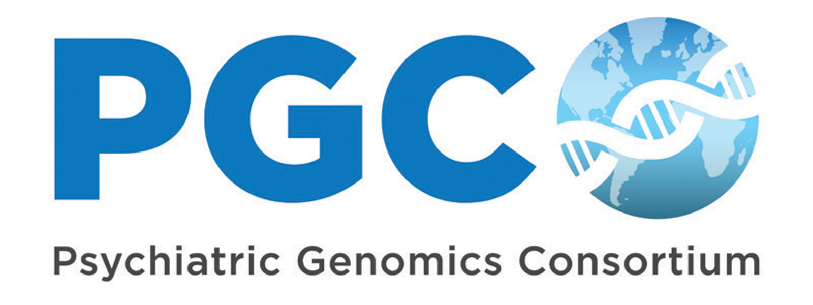

# 🧬 The Psychiatric Genomics Consortium (PGC)

## 🌟 Our Mission
The **Psychiatric Genomics Consortium** is one of the most ambitious collaborations in the history of psychiatry.  
We unite over **800 investigators** across **36 countries**, working with data from **400,000+ participants** to accelerate discovery in the genetic architecture of psychiatric disorders.

---

# 🧰 Software & Resources
The PGC has attracted a cadre of outstanding scientists whose careers center on our work. Many of those researchers have used our data to develop valuable tools for understanding psychiatric genomics, often with important applications in complex trait genetics more generally. We have gathered repositories for such software within our GitHub, and provide descriptions for each below:

---

## **Software Packages**

---

<strong>📦 BPC — Bayesian Polygenic Score Probability Conversion</strong>

**Development lead:** Emil Uffelmann  
🔗 [Original GitHub](https://github.com/euffelmann/bpc) • [PGC repo](https://github.com/psychiatric-genomics-consortium/bpc) • [Paper](https://pubmed.ncbi.nlm.nih.gov/41006251/)

BPC (Bayesian polygenic score Probability Conversion) computes an individual's predicted disorder probability from Bayesian PGS methods (e.g. PRScs below) and a prior disorder probability. 

---

<strong>🧬 CC‑GWAS — Case–Case GWAS</strong>

**Development lead:** Wouter Peyrot  
🔗 [Original GitHub](https://github.com/wouterpeyrot/CCGWAS) • [PGC repo](https://github.com/psychiatric-genomics-consortium/CCGWAS) • [Paper](https://pubmed.ncbi.nlm.nih.gov/33686288/)

CC-GWAS (Case-case GWAS) is an R package for case-case association testing of two different disorders based on their respective case-control GWAS results.

---

<strong>🧩 DDx‑PRS — Differential Diagnosis PRS</strong>

**Development lead:** Wouter Peyrot  
🔗 [Original GitHub](https://github.com/wouterpeyrot/DDxPRS) • [PGC repo](https://github.com/psychiatric-genomics-consortium/DDxPRS) • [Preprint](https://www.medrxiv.org/content/10.1101/2024.02.02.24302228)

DDx-PRS (Differential Diagnosis-Polygenic Risk Score) is an R package for distinguishing clinically related disorders by jointly estimating posterior probabilities for each possible diagnostic category. 

---

<strong>📐 GenomicSEM — Structural Equation Modelling</strong>

**Development leads:** Andrew Grotzinger, Michel Nivard  
🔗 [Original GitHub](https://github.com/GenomicSEM/GenomicSEM) • [PGC repo](https://github.com/psychiatric-genomics-consortium/GenomicSEM) • [Paper](https://pubmed.ncbi.nlm.nih.gov/30962613/)

GenomicSEM is an R-package for fitting user-defined structural equation models to genetic overlap inferred from GWAS summary statistics. Example models that can be run include those with latent factors statistically defined to index shared signal across multiple traits or multiple regression models that estimate partial genetic effects of correlated predictors. Extensions allow for estimating functional enrichment (Stratified Genomic SEM), effects of genetic variants (multivariate GWAS), or associations with imputed gene expression from TWAS (T-SEM) in the model.

---

<strong>📏 GDIS — Genetic Distance of Disorder Subtypes</strong>

**Development lead:** Anaïs Thijssen  
🔗 [Original GitHub](https://github.com/ABThijssen/GDIS) • [PGC repo](https://github.com/psychiatric-genomics-consortium/GDIS) • [Preprint](https://www.medrxiv.org/content/10.1101/2025.11.18.25340484)

GDIS (Genetic DIstance of disorder Subtypes) is an R-package that provides meaningful, generalisable genetic distance metrics between subtypes of a disorder.

---

<strong>📊 PRS‑CS — Polygenic Prediction via Continuous Shrinkage</strong>

**Development lead:** Tian Ge  
🔗 [Original GitHub](https://github.com/getian107/PRScs) • [PGC repo](https://github.com/psychiatric-genomics-consortium/PRScs) • [Paper](https://www.nature.com/articles/s41467-019-09718-5)

PRS-CS is a Python-based command line tool that provides weights for polygenic risk scores through inferring posterior SNP effect sizes under continuous shrinkage (CS) priors using GWAS summary statistics and an external LD reference panel.

---

<strong>🌍 PRS‑CSx — Cross‑Population Polygenic Prediction</strong>

**Development lead:** Tian Ge  
🔗 [Original GitHub](https://github.com/getian107/PRScsx) • [PGC repo](https://github.com/psychiatric-genomics-consortium/PRScsx) • [Paper](https://pmc.ncbi.nlm.nih.gov/articles/PMC9117455/)

PRS-CSx extends PRS-CS to integrate GWAS summary statistics and external LD reference panels from multiple populations to improve cross-population polygenic prediction. 

---

<strong>🧪 SAFFARI — Fine‑Mapping Pipeline</strong>

**Development lead:** Maria Koromina  
🔗 [Original GitHub](https://github.com/mkoromina/SAFFARI) • [PGC repo](https://github.com/psychiatric-genomics-consortium/SAFFARI) • [Paper](https://www.nature.com/articles/s41593-025-01998-z)

SAFFARI is a Snakemake pipeline that implements four different individual variant fine-mapping methods (SuSiE, FINEMAP, PolyFun+SuSiE, PolyFun+FINEMAP). It supports large-scale processing of multiple traits and loci using UK Biobank LD panels and user-specified annotations.

---

<strong>🧭 Tractor — Local‑Ancestry‑Aware GWAS</strong>

**Development lead:** Elizabeth Atkinson  
🔗 [Original GitHub](https://github.com/Atkinson-Lab/TractorWorkflow) • [PGC repo](https://github.com/psychiatric-genomics-consortium/TractorWorkflow)  
📄 [Paper](https://pubmed.ncbi.nlm.nih.gov/33462486/) • [Preprint](https://www.biorxiv.org/content/10.1101/2025.09.02.673402) • [Tutorial](https://atkinson-lab.github.io/Tractor-tutorial/)

Tractor is a method for local-ancestry aware genome-wide association studies, facilitating variant discovery in admixed populations. A WorkFlow pipeline is available, allowing implementation of the approach without the need for advanced bioinformatic expertise.

---

<strong>🌐 Tractor‑Mix — Mixed‑Model Tractor</strong>

**Development lead:** Elizabeth Atkinson  
🔗 [Original GitHub](https://github.com/Atkinson-Lab/Tractor-Mix) • [PGC repo](https://github.com/psychiatric-genomics-consortium/Tractor-Mix) • [Preprint](https://www.medrxiv.org/content/10.1101/2025.05.27.25328444)

Tractor-Mix extends Tractor to a mixed-model implementation, allowing analyses to be conducted using data from related indivduals.

---

# 📚 Paper Repositories

---

<strong>PGC MDD3</strong>

📄 *“Trans-ancestry genome‑wide study of depression identifies 697 associations implicating cell types and pharmacotherapies”*  
🔗 [Paper](https://pubmed.ncbi.nlm.nih.gov/39814019/)  
🔗 [Public repo](https://github.com/psychiatric-genomics-consortium/mdd-wave3-meta)

---

<strong>Genetic Structure of Depressive Symptoms</strong>

📄 *“Genome‑wide meta‑analysis of ascertainment and symptom structures of major depression…”*  
🔗 [Paper](https://doi.org/10.1017/S0033291724001880)  
🔗 [Public repo](https://github.com/psychiatric-genomics-consortium/mdd-symptom-gwas)

---

<strong>Methylome‑Wide Association Study of Depression</strong>

📄 *“A methylome‑wide association study of major depression…”*  
🔗 [Paper](https://www.nature.com/articles/s44220-025-00486-4)  
🔗 [Public repo](https://github.com/psychiatric-genomics-consortium/mdd-mwas)

---

# 📬 Contact

If you would like additional software added or changes made to this README, please contact **[@JoniColeman](https://github.com/JoniColeman)**.
